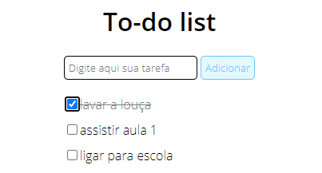

# To-do list

Neste projeto, iremos criar uma simples lista de tarefas.

## Instruções

Antes de clonar o projeto, tente fazer seguindo as instruções abaixo:

1. - [ x ] Crie um campo de `input` de texto e um botão para adicionar a tarefa à lista;
2. - [ x ] Quando o botão for pressionado, o texto deve aparecer na lista com um `checkbox` ao lado;
3. - [ x ] Quando o usuário selecionar o checkbox, o item correspondente deve ficar com o texto riscado. _(ex.: ~~tarefa completa~~. dica: você pode resolver isso facilmente com CSS)_

O resultado esperado é parecido com este:

## Bons estudos!

Não esqueça de publicar a sua versão do projeto no seu Github também! :smile:
